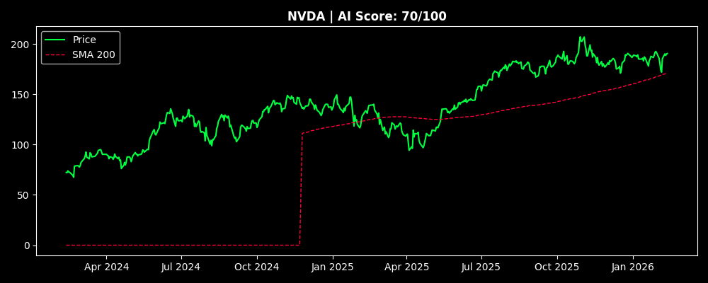
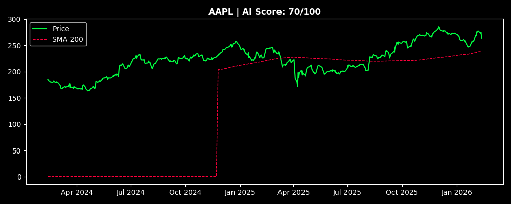
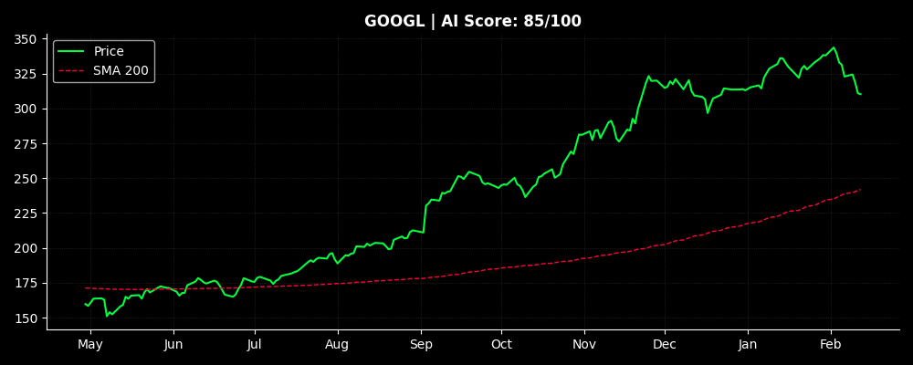

# 📊 Market AI Radar

## 🚀 [Open Live Site](https://almog787.github.io/Stock-information-/)

> Last Updated: 2026-02-12 16:17 UTC

## 🏆 Top Opportunities
### 1. NVDA (Score: 70)

### 2. AAPL (Score: 70)

### 3. GOOGL (Score: 70)

## 📋 Full Rankings
| Rank | Ticker | Price | Change | Score | Signals |
| :--: | :---: | :---: | :---: | :---: | :--- |
| 1 | **NVDA** | $189.26 | 🔴 -0.42% | **70** | 📈 Uptrend |
| 2 | **AAPL** | $267.51 | 🔴 -2.90% | **70** | 📈 Uptrend |
| 3 | **GOOGL** | $310.04 | 🔴 -0.30% | **70** | 📈 Uptrend |
| 4 | **TSLA** | $422.70 | 🔴 -1.30% | **70** | 📈 Uptrend |
| 5 | **BRK-B** | $505.33 | 🟢 1.06% | **70** | 📈 Uptrend |
| 6 | **LLY** | $1028.46 | 🟢 1.31% | **70** | 📈 Uptrend |
| 7 | **AVGO** | $334.66 | 🔴 -2.36% | **70** | 📈 Uptrend |
| 8 | **MSFT** | $399.20 | 🔴 -1.28% | **45** | 📉 Downtrend, 🟢 Oversold |
| 9 | **AMZN** | $198.31 | 🔴 -2.83% | **45** | 📉 Downtrend, 🟢 Oversold |
| 10 | **META** | $649.41 | 🔴 -2.88% | **30** | 📉 Downtrend |

## 🗄️ Database Audit
| Ticker | Records | Time Range |
| :--- | :---: | :--- |
| NVDA | 503 | `2024-02-12` to `2026-02-12` |
| AAPL | 503 | `2024-02-12` to `2026-02-12` |
| GOOGL | 503 | `2024-02-12` to `2026-02-12` |
| TSLA | 503 | `2024-02-12` to `2026-02-12` |
| BRK-B | 503 | `2024-02-12` to `2026-02-12` |
| LLY | 503 | `2024-02-12` to `2026-02-12` |
| AVGO | 503 | `2024-02-12` to `2026-02-12` |
| MSFT | 503 | `2024-02-12` to `2026-02-12` |
| AMZN | 503 | `2024-02-12` to `2026-02-12` |
| META | 503 | `2024-02-12` to `2026-02-12` |
