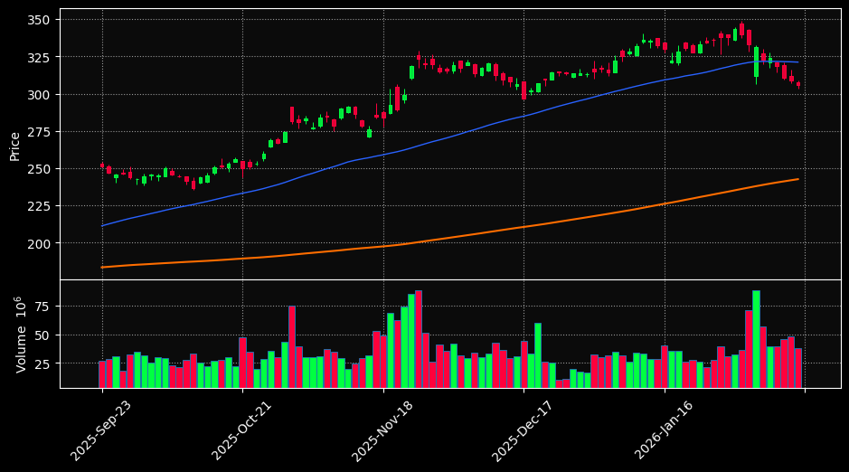
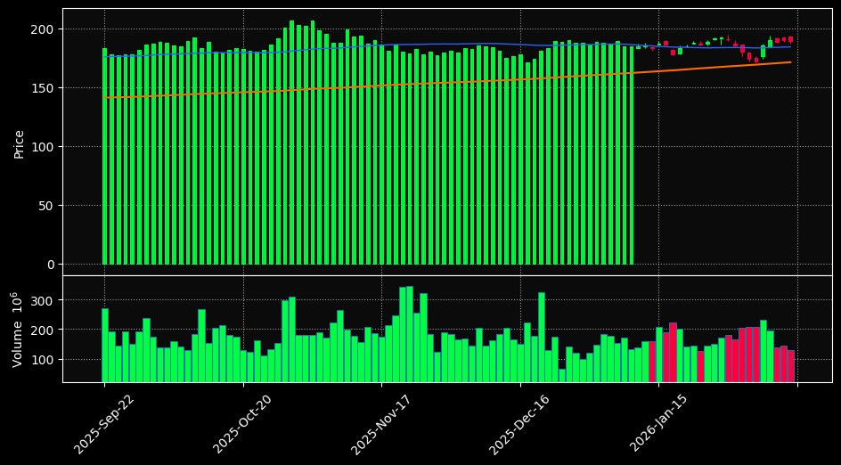
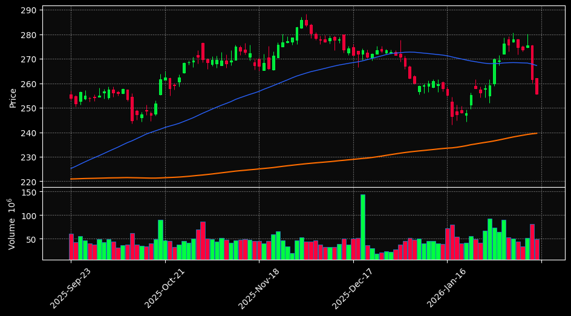
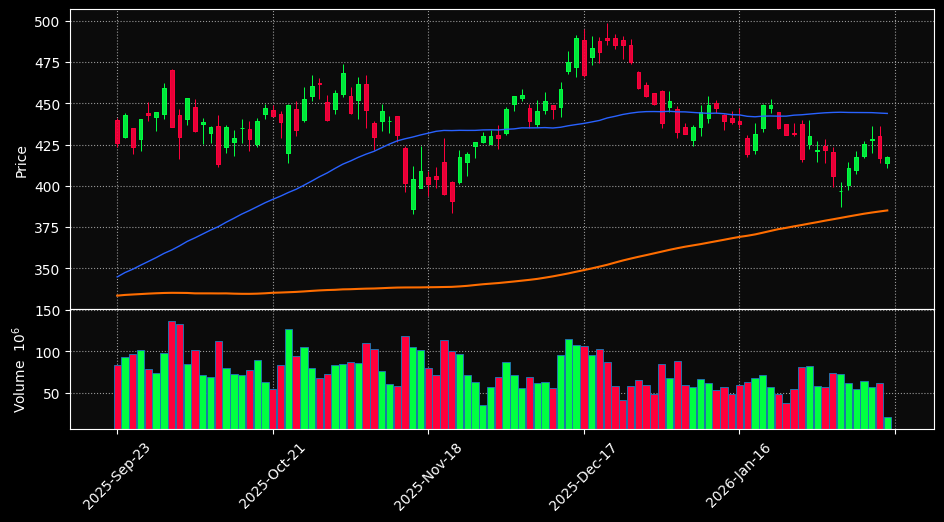
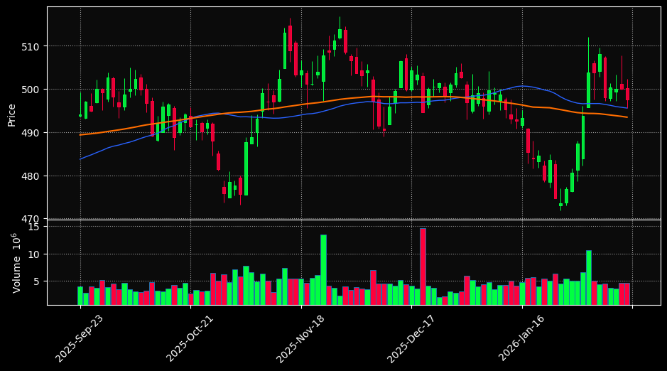
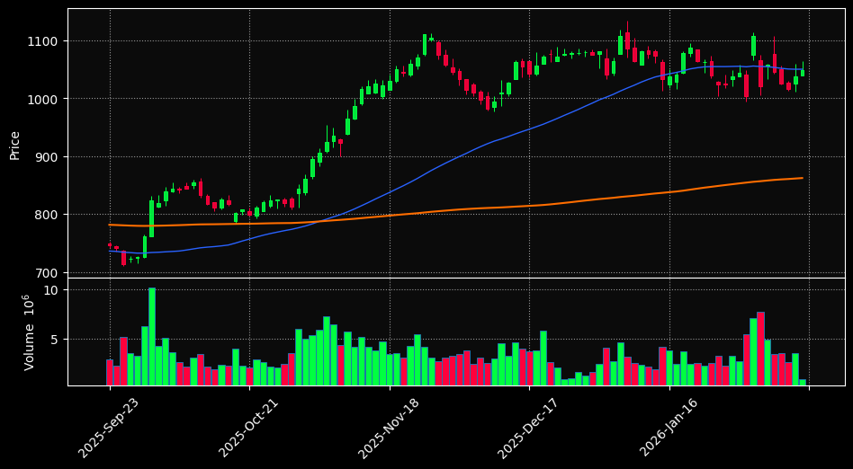
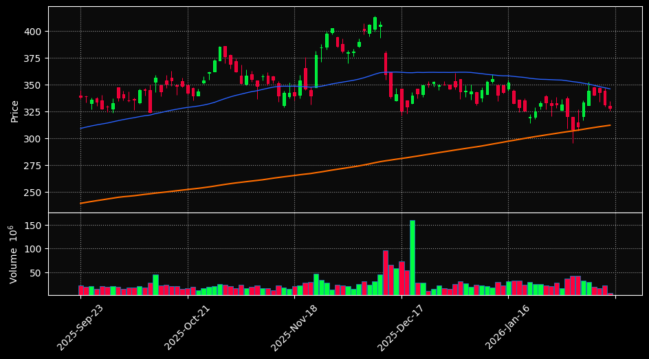
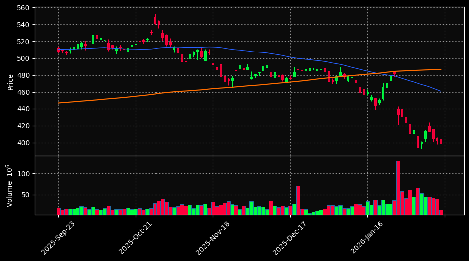
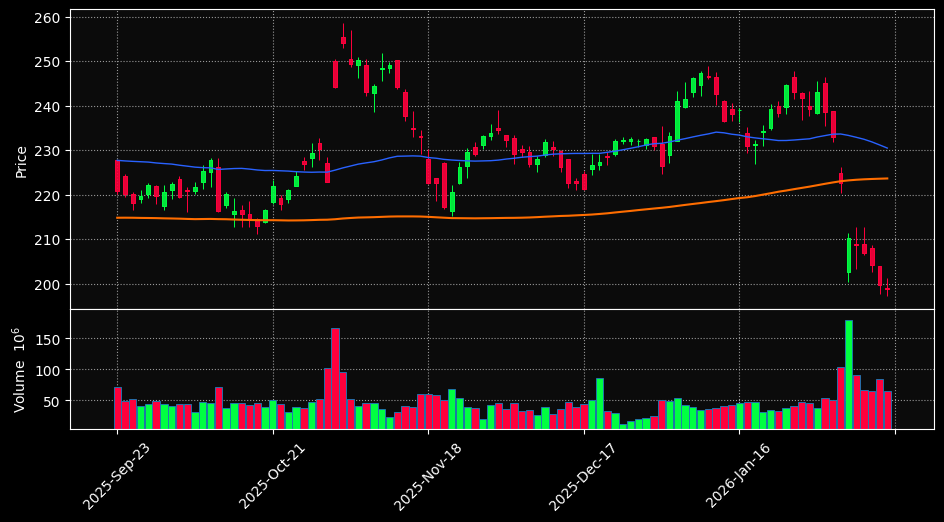
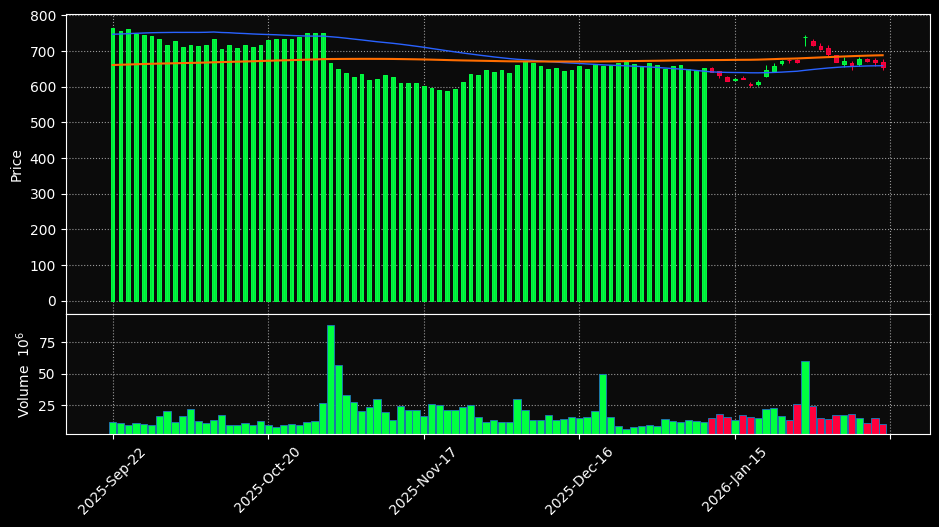

# 🧠 Institutional AI Market Radar | מודיעין שוק מבוסס AI

## 🚀 [Open Interactive Terminal | כניסה לטרמינל האינטראקטיבי](https://almog787.github.io/Stock-information-/)

---

## 📈 Market Analysis Gallery | גלריית ניתוח שוק
*גרפים עבור כל המניות במעקב (100 ימי מסחר אחרונים)*

### 1. GOOGL (AI Score: 85)
**Signals:** `📈 Uptrend, 🟢 Oversold` | **איתותים:** `📈 מגמת עלייה, 🟢 מכירת יתר`

---
### 2. NVDA (AI Score: 70)
**Signals:** `📈 Uptrend` | **איתותים:** `📈 מגמת עלייה`

---
### 3. AAPL (AI Score: 70)
**Signals:** `📈 Uptrend` | **איתותים:** `📈 מגמת עלייה`

---
### 4. TSLA (AI Score: 70)
**Signals:** `📈 Uptrend` | **איתותים:** `📈 מגמת עלייה`

---
### 5. BRK-B (AI Score: 70)
**Signals:** `📈 Uptrend` | **איתותים:** `📈 מגמת עלייה`

---
### 6. LLY (AI Score: 70)
**Signals:** `📈 Uptrend` | **איתותים:** `📈 מגמת עלייה`

---
### 7. AVGO (AI Score: 70)
**Signals:** `📈 Uptrend` | **איתותים:** `📈 מגמת עלייה`

---
### 8. MSFT (AI Score: 45)
**Signals:** `📉 Downtrend, 🟢 Oversold` | **איתותים:** `📉 מגמת ירידה, 🟢 מכירת יתר`

---
### 9. AMZN (AI Score: 45)
**Signals:** `📉 Downtrend, 🟢 Oversold` | **איתותים:** `📉 מגמת ירידה, 🟢 מכירת יתר`

---
### 10. META (AI Score: 30)
**Signals:** `📉 Downtrend` | **איתותים:** `📉 מגמת ירידה`

---

## 📋 Rankings Summary Table | טבלת דירוג מרוכזת
| Rank | Symbol | Price | Change | AI Score | RSI |
| :--- | :--- | :---: | :---: | :---: | :---: |
| 1 | **GOOGL** | $305.72 | 🔴 -1.06% | **85** | 23.4 |
| 2 | **NVDA** | $182.81 | 🔴 -2.21% | **70** | 46.7 |
| 3 | **AAPL** | $255.78 | 🔴 -2.27% | **70** | 50.6 |
| 4 | **TSLA** | $417.44 | 🟢 0.09% | **70** | 41.9 |
| 5 | **BRK-B** | $497.55 | 🔴 -0.49% | **70** | 61.8 |
| 6 | **LLY** | $1040.00 | 🟢 0.17% | **70** | 47.1 |
| 7 | **AVGO** | $325.17 | 🔴 -1.81% | **70** | 50.2 |
| 8 | **MSFT** | $401.32 | 🔴 -0.13% | **45** | 24.9 |
| 9 | **AMZN** | $198.79 | 🔴 -0.41% | **45** | 16.7 |
| 10 | **META** | $639.77 | 🔴 -1.55% | **30** | 42.1 |

---
## 📘 Legend & Definitions | מקרא והסברים

| Term | מונח | Description | תיאור |
| :--- | :--- | :--- | :--- |
| **AI Score** | **ציון AI** | Quality rating (0-100). | דירוג איכות כללי (0-100). |
| **SMA 200** | **ממוצע 200** | Orange line. Long-term trend. | קו כתום. מגמה ארוכת טווח. |
| **RSI** | **מדד חוזק** | Momentum indicator (30-70 range). | מדד מומנטום (טווח 30-70). |

---
## 🗄️ Database Audit | ביקורת נתונים
| Ticker | Records | Time Range | Status |
| :--- | :---: | :--- | :---: |
| GOOGL | 5407 | `2004-08-19` - `2026-02-13` | ✅ Verified |
| NVDA | 6808 | `1999-01-22` - `2026-02-13` | ✅ Verified |
| AAPL | 11385 | `1980-12-12` - `2026-02-13` | ✅ Verified |
| TSLA | 3932 | `2010-06-29` - `2026-02-13` | ✅ Verified |
| BRK-B | 7490 | `1996-05-09` - `2026-02-13` | ✅ Verified |
| LLY | 13539 | `1972-06-01` - `2026-02-13` | ✅ Verified |
| AVGO | 4157 | `2009-08-06` - `2026-02-13` | ✅ Verified |
| MSFT | 10059 | `1986-03-13` - `2026-02-13` | ✅ Verified |
| AMZN | 7233 | `1997-05-15` - `2026-02-13` | ✅ Verified |
| META | 3455 | `2012-05-18` - `2026-02-13` | ✅ Verified |

---
*Auto-generated by GitHub Actions using Python & yfinance. Last sync: 2026-02-13 21:20 UTC*